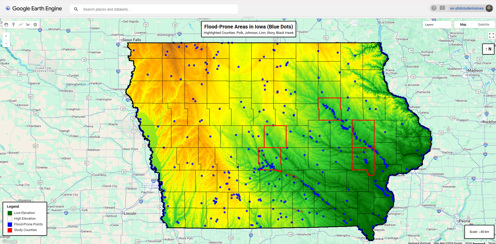

<table>
  <tr>
    <td align="left">
      <h1>Flood-Prone Point Mapping in Iowa (Google Earth Engine)</h1>
    </td>
    <td align="right">
      
    </td>
  </tr>
</table>

**Figure 1.** Spatial distribution of flood-prone points across Iowa derived from long-term
surface water occurrence (JRC Global Surface Water v1.4) and topographic context from
the USGS 3DEP (10 m) digital elevation model.

---

## Scientific Motivation

Flood hazard assessment is commonly conducted using coarse administrative units or
predefined hydrologic boundaries, which may obscure fine-scale spatial variability in
flood susceptibility. This workflow demonstrates a scalable, satellite-driven alternative
that identifies persistent surface water–prone locations directly from long-term Earth
observation records, supporting exploratory flood risk screening and GeoAI-based
modeling applications.

## Data Sources

- **US Census TIGER/2018** — Iowa and county administrative boundaries  
- **USGS 3DEP (10 m)** — digital elevation model for topographic context  
- **JRC Global Surface Water v1.4** — long-term surface water occurrence (%)

## Method Summary

1. Load Iowa state boundary and county feature collections  
2. Select study counties (Polk, Johnson, Linn, Story, Black Hawk)  
3. Threshold surface water occurrence greater than 70%  
4. Convert flood-prone raster cells to centroid-based point vectors  
5. Visualize elevation, water occurrence, flood-prone points, and boundaries  

## Results

- Total flood-prone points identified across Iowa: **565**
- Study counties highlighted for focused regional analysis

## Visualizations

### Statewide Flood-Prone Points (Iowa)

## Code

- Google Earth Engine implementation:  
  `gee/iowa_flood_points.js`

## Notes & Limitations

- Surface water occurrence represents long-term persistence and does not correspond to
  regulatory floodplain boundaries.
- Results are intended for regional screening and visualization rather than parcel-scale
  flood risk determination.

## Citation

Mukarram, M. M. T. (2026). *Flood-Prone Point Mapping in Iowa using Google Earth Engine*.
GitHub repository.
